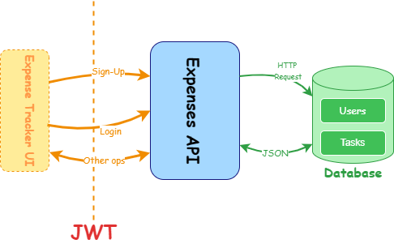

<div style="text-align: center;">
<h1>
Expense Tracker API
</h1>
</div>

<div style="text-align: center;">


</div>

## Deskripsi

Expense Tracker API adalah sebuah API yang dibangun menggunakan NestJS untuk melacak pengeluaran. API ini menyediakan fitur-fitur seperti mendaftar sebagai pengguna baru, otentikasi dengan JWT, menambah, memperbarui, menghapus, dan melihat pengeluaran dengan berbagai filter.

## Fitur

- **Autentikasi JWT**: Untuk melindungi endpoint dan mengidentifikasi pengguna.
- **Manajemen Pengeluaran**: Menambah, memperbarui, menghapus, dan melihat pengeluaran dengan filter.
- **Kategori Pengeluaran**: Groceries, Leisure, Electronics, Utilities, Clothing, Health, Others.

## Teknologi yang Digunakan

- **NestJS**: Framework untuk membangun server-side aplikasi.
- **MongoDB**: Database NoSQL untuk menyimpan data pengeluaran.
- **JWT**: Untuk otentikasi dan manajemen sesi pengguna.

## Instalasi

### Prasyarat

Pastikan Anda telah menginstal:

- Node.js (versi terbaru)
- MongoDB (berjalan di mesin lokal atau di server)

### Langkah-langkah

 **Kloning repositori ini**

```bash
git clone https://github.com/username/expense-tracker-api.git
cd expense-tracker-api
```

 **Instal dependensi**

```bash
npm install
```

 **Buat file `.env`**

Buat file `.env` di root proyek dan tambahkan konfigurasi berikut:

```env
MONGO_URI=mongodb://localhost:27017/expense-tracker
JWT_SECRET=your_jwt_secret_key
```

 **Jalankan aplikasi**

Untuk menjalankan aplikasi dalam mode pengembangan:

```bash
npm run start:dev
```

 **Jalankan pengujian**

Untuk menjalankan pengujian E2E:


```bash
npm run test:e2e
```

## Penggunaan Api

**Mendaftar User Baru**

- Endpoint: POST /auth/signup
- Body:
```json
{
  "email": "user@example.com",
  "password": "password123"
}
```
**Masuk**
- Endpoint: POST /auth/login
- Body:
```json
{
  "email": "user@example.com",
  "password": "password123"
}
```

## Menambah Pengeluaran
- Endpoint: POST /expenses
- Header: Authorization: Bearer <JWT_TOKEN>
- Body:
```json
{
  "amount": 100,
  "description": "Grocery shopping",
  "category": "Groceries",
  "date": "2023-10-10"
}
```

## Melihat Pengeluaran

- Endpoint: GET /expenses
- Header: Authorization: Bearer <JWT_TOKEN>
